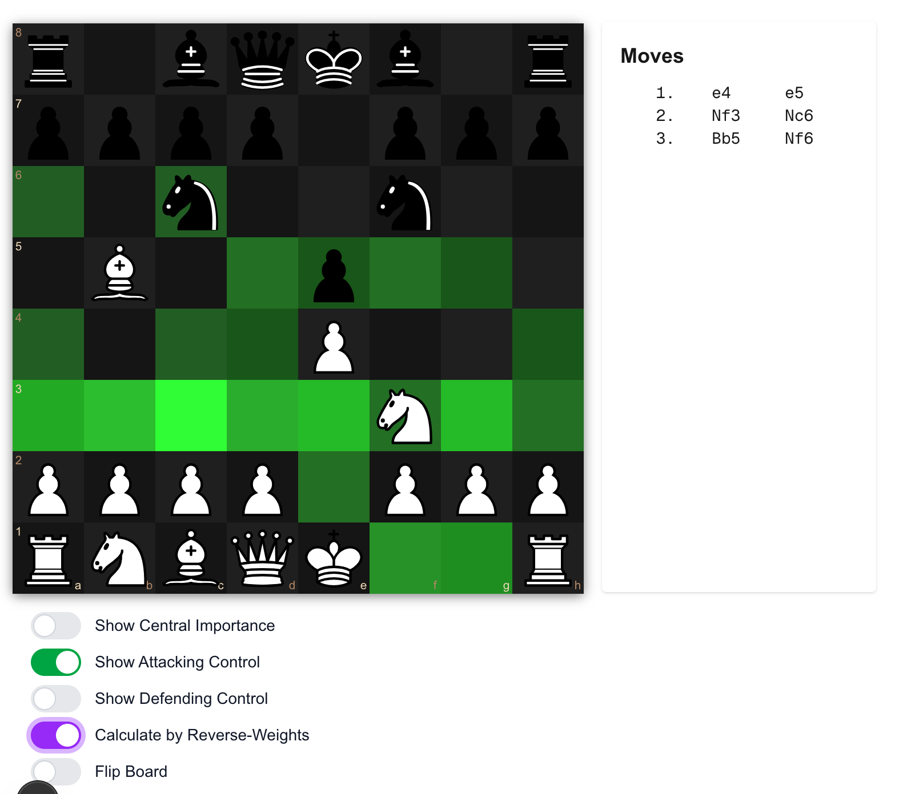

# Chess Vision
Chess Vision System created by YourApp.ie ©2025



This is a [Next.js](https://nextjs.org) project bootstrapped with [`create-next-app`](https://nextjs.org/docs/app/api-reference/cli/create-next-app).

## Getting Started

First, run the development server:

```bash
npm run dev
# or
yarn dev
# or
pnpm dev
# or
bun dev
```

Open [http://localhost:3000](http://localhost:3000) with your browser to see the result.

## Chess Vision System Features

This chess application includes several unique features for analyzing board control and piece influence:

1. **Central Control Analysis**
   - Visualizes the importance of central squares
   - Highlights the strategic value of the center of the board

2. **Attacking Control Analysis**
   - Shows which squares are under attack by pieces
   - Visualizes the attacking influence of each piece
   - Can be toggled with the "Show Attacking Control" switch

3. **Defending Control Analysis**
   - Displays which squares are defended by pieces
   - Visualizes the defensive influence of each piece
   - Can be toggled with the "Show Defending Control" switch

4. **Reverse-Weight Calculation**
   - Option to calculate control using reverse weights
   - Provides alternative perspective on board control
   - Uses inverse piece values (Queen=1, Rook=5, Bishop=7, Knight=7, Pawn=9)
   - Helps visualize control from the perspective of piece vulnerability
   - Useful for identifying weak squares and potential tactical opportunities

The application uses color gradients to represent the intensity of control over squares, making it easy to visualize strategic positions and piece influence on the board.
